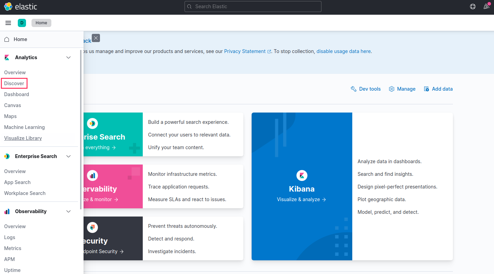
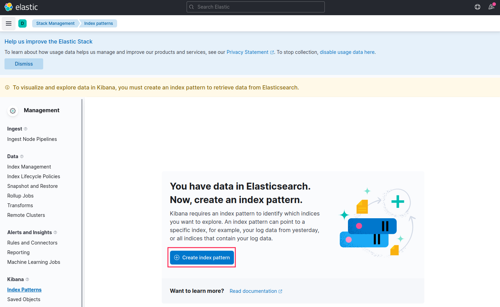
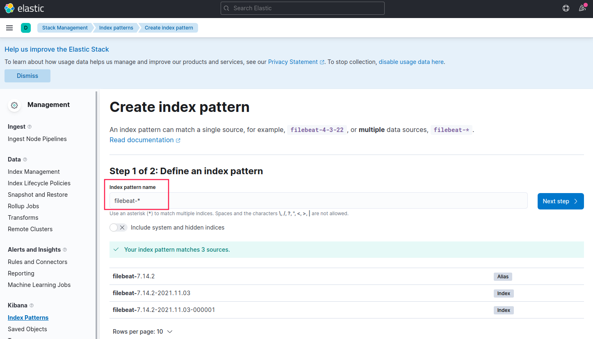
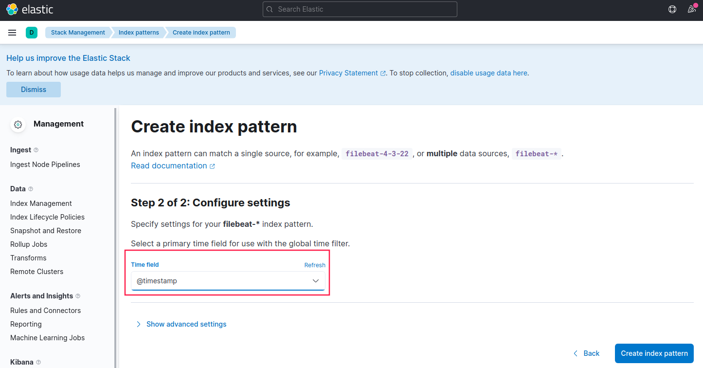
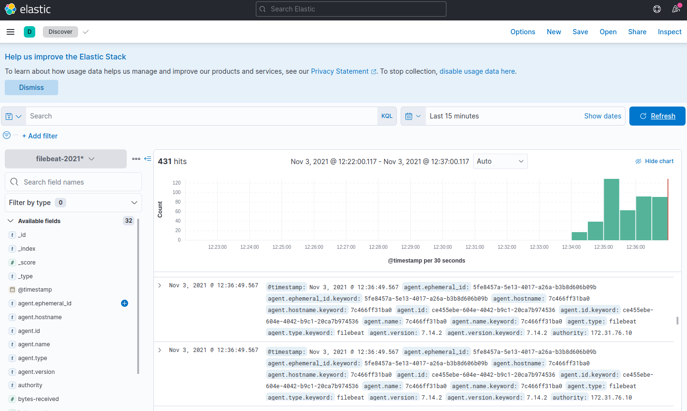

## 使用EFK收集Envoy的访问日志 
### 环境说明

##### Envoy Mesh使用的网络: 172.31.76.0/24

##### 7个Service:

- front-envoy：Front Proxy,地址为172.31.76.10
- 3个后端服务，仅是用于提供测试用的上游服务器
  - service_blue
  - service_red
  - service_green
- 三个日志服务
  - elasticsearch，地址为172.31.76.15，绑定宿主机的9200端口
  - kibana，地址为172.31.76.16，绑定宿主机的5601端口
  - filebeat

##### 特殊要求

目录logs/envoy/下的日志文件front-envoy-access.log的属主需要修改为envoy容器中运行envoy进程的用户envoy，其UID和GID默认分别为100和101，否则，front-envoy进程将日志写入到该文件时，将显示为“Permission Denied.”

```
chown 100.101 logs/envoy/front-envoy-access.log
```

### 运行并测试

1.  启动服务

   ```
   docker-compose up
   ```
   
2. 文本日志

   先使用类似如下命令向Front-Envoy发起请求，以便持续生成访问日志；

   ```
   while true; do curl 172.31.76.10/service/colors; sleep 0.$RANDOM; done
   ```
   
3. 确认ElasticSearch服务正常工作，且Filebeat已经输出日志信息到指定的索引中

   ```
   curl 172.31.76.15:9200
   # 正常运行的ElasticSearch将返回类似如下内容
   {
     "name" : "myes01",
     "cluster_name" : "myes",
     "cluster_uuid" : "QSAkdrV-QziRgGuZUgbCyg",
     "version" : {
       "number" : "7.14.2",
       "build_flavor" : "default",
       "build_type" : "docker",
       "build_hash" : "6bc13727ce758c0e943c3c21653b3da82f627f75",
       "build_date" : "2021-09-15T10:18:09.722761972Z",
       "build_snapshot" : false,
       "lucene_version" : "8.9.0",
       "minimum_wire_compatibility_version" : "6.8.0",
       "minimum_index_compatibility_version" : "6.0.0-beta1"
     },
     "tagline" : "You Know, for Search"
   }
   ```

   查看是否已经存在由filebeat生成的索引；

   ```
   curl 172.31.76.15:9200/_cat/indices
   # 命令返回的索引中包含类似如下内容，即表示filebeat已经生成相应的索引
   ……
   yellow open filebeat-2021.11.03               VTqwVr_8RD2k8aGal-YCHg 1 1 44   0 80.6kb 80.6kb
   ……
   ```

   

4. 访问Kibana

   在宿主机可以访问Kibana，端口为5601

   

   第二步：

   

   第三步：

   

   第四步：

   

   

   第五步：再次访问Discover，即可看到由filebeat收集的envoy的日志

   

5.  进一步操作

    可采用类似于Front-Envoy的方式，将service_blue、service_red和service_green的日志都收集到ElasticSearch之中。

6. 停止后清理

```
docker-compose down
```

## 版权声明

本文档版本归[马哥教育](www.magedu.com)所有，未经允许，不得随意转载和商用。
